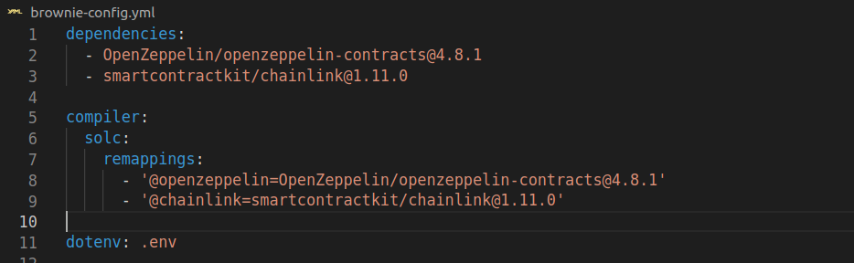
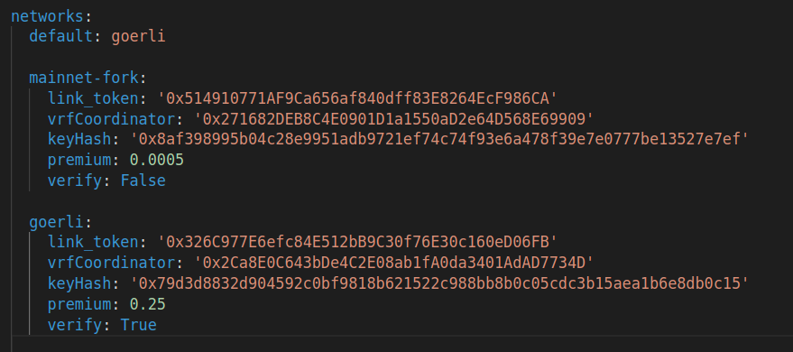
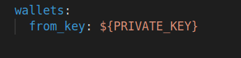

# NFTRunners com Framework Brownie

Esse repósitório tem como base o projeto NFTRunners implementado na penúltima aula do bootcamp Chainlink PT. A partir dele está sendo implementado um ambiente de desenvolvimento com ferramentas necessárias para melhorar a experiência na execução do ROADMAP proposto. A IDE remix tem ótimas funcionalidades, mas a medida que os projetos crescem em tamanho, numero de pessoas participando, em necessidade de testes, uma ferramenta local mais robusta pode contribuir muito para o sucesso do projeto.

Esse projeto está sendo desenvolvido utilizando a stack `Solidity + python + brownie`. A documentação do framework brownie pode ser encontrada [aqui](https://eth-brownie.readthedocs.io/en/latest/toctree.html).

Usando brownie é possível desenvolver usando um ambiente simples e robusto para desenvolvimento, teste, deploy e interações automatizadas com contratos inteligentes, nas mais diferentes redes de blockchain EVMm EVM. Seguem alguns exemplos de protocolos suportados por brownie:

    Ethereum
        ├─Mainnet (Infura): mainnet
        ├─Ropsten (Infura): ropsten
        ├─Rinkeby (Infura): rinkeby
        ├─Goerli (Infura): goerli
        ├─Kovan (Infura): kovan
        └─ganache-dadaia: ganache-dadaia
    Ethereum Classic
        ├─Mainnet: etc
        └─Kotti: kotti
    Arbitrum
        └─Mainnet: arbitrum-main
    Avalanche
        ├─Mainnet: avax-main
        └─Testnet: avax-test
    Binance Smart Chain
        ├─Testnet: bsc-test
        └─Mainnet: bsc-main
    Fantom Opera
        ├─Testnet: ftm-test
        └─Mainnet: ftm-main
    Harmony
        └─Mainnet (Shard 0): harmony-main
    Optimistic Ethereum
        ├─Mainnet: optimism-main
        └─Kovan: optimism-test
    Polygon
        ├─Mainnet (Infura): polygon-main
        └─Mumbai Testnet (Infura): polygon-test

As redes acima, podem ser consultadas usando o comando `brownie networks list` na linha de comando.

## 1 - ROADMAP

Segue abaixo as melhorias propostas para o projeto NFTRunners, não em questão específica de alteração de funcionalidades no contrato num primeiro momento, mas criando um ambiente de desenvolvimento para posteriormente alcançar esse fim.

### 1.1 - Contrato NftRunners:

- Parâmetrização no construtor de atributos setados como constantes no contrato visto em aula. Especificamente o endereço do VRFCoordinator, Keyhash, CallbackGasLimit e requestConfirmations. Isso torna o contrato flexivel para deploy em diferentes networks.

- Implementação de rotina automatizada para realização de deploy dos contratos e verificação dos mesmos em redes de teste.
- Implementação de VRFCoordinator2Mock para realização de testes nas redes de fork mainnet-fork, polygon-mainnet-fork.
- Implementação de testes unitários usando as redes de fork mainnet-fork e polygon-mainnet-fork.
- Implementação de funções em python para interagir diretamente com contratos ja deployados.
- Implementação de testes de integração

### 1.2 Contrato NftRunnersFactory:

- Smart Contract NFTRunnersFactory implementado, seguindo o padrão de contráto fábrica. A chamada do método `createNftRunner` realiza o deploy de um contrato NFTRunners.

## 2 - Como instalar o brownie

## 3 - Estrutura de um projeto no framework Brownie

Segue abaixo um breve resumo do que compõe a estrutura de um projeto utilizando o framework Brownie. A estrutura inicial de um projeto é montada quando o comando `brownie init <project_name>`.

### 3.1 - Build 

Diretório onde são descarregados dados gerados quando contratos ou interfaces são compiladas. Essa pasta é gerenciada pelo framework brownie, não sendo necessário 

### 3.2 - Contracts

Diretório onde o brownie procura os smart contracts para compilar.

### 3.3 - Interfaces

Diretório onde o brownie procura os smart contracts para compilar. Após compilação a ABI das interfaces é escrita em build/interfaces.

### 3.4 - Scripts

Diretório onde ficam rotinas escritas em python para realizar o deploy dos smart contracts e também rotinas para interagir com o smart contract via python.

### 3.5 - Tests

Pasta onde são escritos testes unitários e de integração. Os testes podem ser criados para executar nos mais diferentes ambientes, tais como redes locais e testnets forks de mainnets.

### 3.6 brownie-config.yml

Arquivo com configurações base para o framework brownie onde é possivel configurar:

- Repositórios git para serem usados como import nos smart contracts. Com as linhas de código abaixo por exemplo é possível configurar o endpoint '@openzeppelin' para ser usado nos imports, dentro dos contratos inteligentes.:

- Variáveis de ambiente para serem utilizadas em diferentes redes blockchain. Essas variáveis podem ser carregadas dentro de rotinas python usando o módulo `config` do brownie.

- Configurar uma wallet para usar um endereço para interagir com a blockchain. Geralmente o valor passado para a chave `wallets`
está em um arquivo .env, que jamais deve subir para um repositório público por motivos de segurança.

### 3.7 Arquivo .env